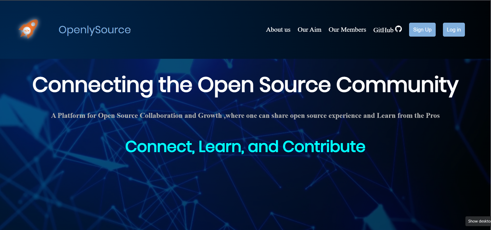

# Welcome to OpenlySource Community

OpenlySource is a open source community , where you learn more about open source contribution to large codebases , interact with some of the best open source contributors 🚀

### 🧾 Prerequisites

Before starting out, you'll need to install the following on your computer.

To learn React, check out the [React documentation](https://reactjs.org/).

## How to Start 🚀

Want to be a openlysource community member , take these steps :-
1 fork this repo , copy the URL and run this command in vs code terminal

### `git clone URL `

2 change the directory by running this command

### `cd openlysource`

3 now install the dependencies by running this command

### `npm install`

4 run the application by running this command

### `npm run start`

Runs the app in the development mode.\
Open [http://localhost:3000](http://localhost:3000) to view it in your browser.

## On What stack will OpenlySource built on?

## Aim

1 Why to contribute to this repo ?
Main aim of this community is to spread awareness and importance of open source contribution in today's world .By doing contribution to this repo you will learn new things in the world of open source

# What to expect from this openlysource

- You can share your open source contribution experience
- you will get update regarding upcoming open source events like (Summer of bitcoins , GSOC )
- you will get tips and tricks from those who have cracked all such open source events
- you can make your open source profile , with your skills and achievements
- many more features ......

# CONTRIBUTING GUIDELINES [click here](./CONTRIBUTING.md)

# CODE OF CONDUCT [click here](./CODE_OF_CONDUCT.md)

### Here you go 🚀🚀🚀
